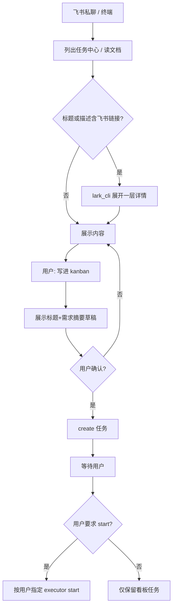

# Helios Task Agent — 全流程说明

面向维护者。用户入口：[README.md](../../README.md)。索引：[README.md](./README.md)。

## 当前约定

| 步骤 | 行为 | 自动？ |
|------|------|--------|
| 列出飞书任务 | `lark_cli`；含链接则展开一层 | 是（用户要求列出时） |
| 写进看板 | 草稿 → 确认 → create | **否**（代码闸门强制确认） |
| start workspace | 听用户指定 executor | **否**（代码闸门强制确认） |

## 主路径

## 模块对照

| 能力 | 实现 | 备注 |
|------|------|------|
| 飞书长连接 bot | `src/bot.ts`, `channels/feishu.ts` | 仅 p2p；进程常驻 |
| 终端 REPL | `src/cli.ts` | |
| 系统规则 | `src/prompt.ts` | 展开 / 写看板 / 不擅自 start |
| 写操作闸门 | `src/guard.ts`, `src/tools.ts` | 分类 read/write；写操作强制用户确认；「同类免问」批量 10 分钟免重复确认（默认仅此次；可「恢复确认」/ `/confirm on` 撤销） |
| 确认通道 | `src/confirm.ts`, `src/cli.ts` | CLI y/b/N；飞书三按钮卡片 / 文本兜底；决策/超时/作废后卡片原地更新为终态；破坏性操作超时 300s、其余 120s；/stop 一并取消挂起确认 |
| 访问控制 | `channels/feishu.ts` | 白名单为空 → 首个私聊用户认领 owner 并写回 .env |
| 来源查重 | `src/source-registry.ts` | 飞书 URL → 看板任务映射 |
| 审计 | `src/audit.ts` | `~/.helios-task-agent/audit.log` |
| 状态推送 | `src/watcher.ts` | 轮询看板 → 飞书通知（注入会话上下文） |
| MCP 监督 | `src/bot.ts`, `src/mcp.ts` | 60s 探测，掉线降级 + 自动重连切回 |
| 排队回执 | `src/bot.ts`, `src/session-router.ts` | 任务忙或确认挂起时新消息立即收到提示 |
| 看板自动拉起 | `src/kanban-ensure.ts` | `HELIOS_KANBAN_AUTO_START` |
| 本地读仓 | `src/repo-fs.ts` | 可选 |
| 看板 API | MCP + `skills/.../hk.sh` | MCP 优先 |
| 记忆 | `src/memory.ts` | `~/.helios-task-agent/memory.json` |

## 规格

| 文档 | 状态 |
|------|------|
| [feishu-task-link-expand-design](./specs/2026-07-21-feishu-task-link-expand-design.md) | implemented |
| [feishu-to-kanban-design](./specs/2026-07-21-feishu-to-kanban-design.md) | implemented |
| [write-gate-design](./specs/2026-07-22-write-gate-design.md) | implemented |
| [trust-batch-progress-design](./specs/2026-07-22-trust-batch-progress-design.md) | implemented（晨报已于 2026-07-25 移除） |
| [bot-experience-p1-design](./specs/2026-07-22-bot-experience-p1-design.md) | implemented |

## 审查结论（本轮）

### 一致（代码 ↔ 文档）

- 主路径已统一为「展开 → 确认写入 → 用户决定是否 start」
- 无强制 Kimi Plan / 固定 executor 的 prompt 专节
- `repo_fs` 标为可选；README / WORKFLOW / specs 一致
- 规格文件名已去掉误导性的 `tech-design`

### 已知限制（接受）

1. ~~展开 / 确认 / 不擅自 start 靠 prompt~~ → 已有代码层写闸门（见 write-gate-design）；展开等**读流程**仍靠 prompt 约定  
2. Bot **仅私聊**；进程退出即断长连接  
3. 读飞书依赖本机 **lark-cli**  
4. `hk create-and-start` 仍存在于技能表：仅当用户**明确**要求「创建并启动」时使用，默认写看板走 create-only  
5. 卡片按钮回调需在开放平台配置「卡片回传交互」长连接；未配置时降级为文本「确认/都允许/取消」

### 本轮文档/文案修补

- 重命名 specs/plans：`feishu-to-kanban*`
- 更新 README 链接、bot/cli 帮助示例
- 增加 `docs/superpowers/README.md` 索引
